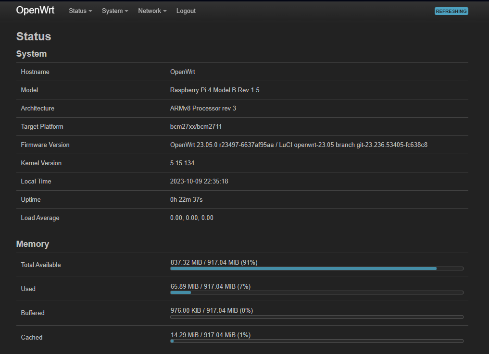
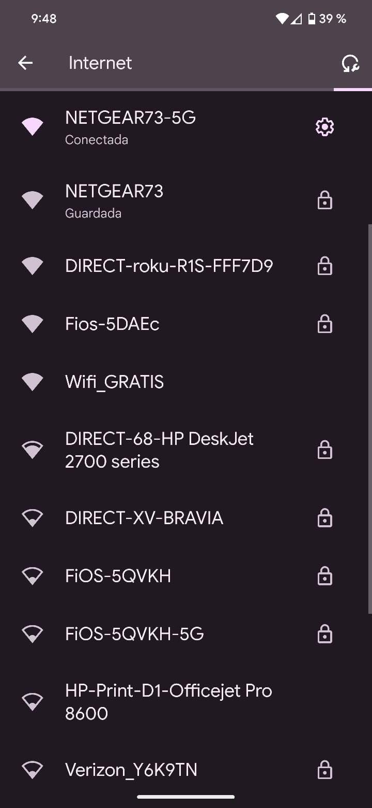

# CaptivePortalGuide: GUIA PARA ESPECIFICAMENTE HACERLO FUNCIONAR EN RASPBERRY PI 4B

Basicamente segui los pasos del tutorial de youtube:\
https://www.youtube.com/watch?v=jlHWnKVpygw&t=597s
En caso de que el tutorial ya no este en linea lo descargue y lo tengo en mi drive publico:
https://drive.google.com/drive/folders/1Pv3NOzGnVHLNCD1gwwUuR6ygyMyayGDn?usp=sharing

Ese tutorial lo segui porque inicialmente me interesaba un router VPN seguro pero me fue de mas ayuda entender lo que este vato
estaba haciendo para entender bien como configurar openWRT.

## Paso 1:
Instale el software Raspberry Pi Imager de su sition oficial:
https://www.raspberrypi.com/software/

## Paso 2:
Descargue el software de OpenWRT para raspberry pi de su sitio oficial:
https://firmware-selector.openwrt.org/?version=23.05.3&target=bcm27xx%2Fbcm2708&id=rpi
especificamente escogi la imagen FACTORY (SQUASHFS), hay unas descripciones y creo que esa era la mejor.
Una vez que este terminada la instalacion solo sacar la memoria SD y listo.

## Paso 3:
1. Insertar la memoria SD en la raspberry pi
2. Conectar la raspberry pi al puerto ethernet de tu pc
3. Conectar la raspberry pi a alimantacion (cargador USB C)
4. IMPORTANTE: Hasta este punto no conectar la antena wifi externa para no confundirla con la externa, no pasa nada, se puede configurar cualquiera como 'Emisor' y como 'Receptor' pero siguiendo estos pasos ya funciona asi que para que jugarle al chingon.

## Paso 4(En windows):
1. Ir a panel de control
2. Network and internet
3. Network and sharing center
4. Click en 'Ethernet' para abrir la configuracion de la coneccion de ethernet
5. Propiedades, y luego en 'Internet protocol ipV4' o algo asi
6. Luego vamos a modificar a que sea una ip manual 'use the following ip address' y ponemos la siguiente configuracion:
   - IP: 192.168.1.10
   - Subne: 255.255.255.0
   - Gateway: 192.168.1.1
7. Click en ok y en ok para guardar y salir.
8. Abrir el command prompt
9. Ahora ya nos podemos conectar a la raspberry pi por SSH:
  - SSH root@192.168.1.1

### NOTA IMPORTANTE: No me estaba dejando  configurar esta nueva raspberry pi porque ya habia configurado una conexion ssh a la anterior que configure y use esa ip
### la solucion es borrar la configuracion de conexion ssh en el siguiente documento: C:\Users\<your user name>\.ssh , ahi dentro hay un archivo y si ya tienes una coneccion
### ssh con la ip 192.168.1.1 borra esa linea nada mas y listo.

10. Al ejecutar la coneccion ssh del paso nueve le decimos que si ( 'yes' ) y listo, estamos dentro de openwrt.
11. Una vez dentro, cambiemos la contrasenia default de la raspberry con el siguiente comando: passwd, y luego creamos nuestra nueva contrasenia.
12. luego nos vamos a la siguiente ruta: cd /etc/config
13. Los documentos importantes de configuracion son los siguientes: 'firewall', 'wireless' y 'network' asi que hacemos un backup de los tres ejecutando los siguientes comandos(por si la cagamos en la configuracion siempre es buena idea hacer un bk de los documentos originales que empezaremos a modificar):
    - cd firewall firewall.bk
    - cd wireless wireless.bk
    - cd wireless network.bk
14. Ahora hay que cambiar la ip de la raspberry porque 192.168.1.1 es el mas comun en los router y pues eso lo hace mas facil de hackear al parecer, abrimos el archivo 'network' ejecutando:
    - vi network
15. Vamos a modificar las lineas:
    ```bash
    config interface 'lan'
        option device 'br-lan'
        option proto 'static'
        option ipaddr '192.168.1.1'
        option netmask '255.255.255.0'
        option ip6assign '60'
    ```
    #por lo siguiente:
```bash
    config interface 'lan'
        option device 'br-lan'
        option proto 'static'
        option ipaddr '10.10.***.***'
        option netmask '255.255.255.0'
        option ip6assign '60'
        option force_link '1'
   ```
NOTA: en la opcion: option ipaddr '10.10.***.***' sustituye los *** por cualquier numero, pero si es importante que inicie con 10.10... porque si no no te deja configurar cosas como smart tv porque dice que estas en una red publica, creo que los 198... los 10.10... son ip para redes privadas.

17. Luego agregamos las siguientes lineas al final del archivo network:
    ```bash
    config interface 'wwan'
        option proto 'dhcp'
        option peerdns '0'
        option dns '1.1.1.1 8.8.8.8'
    ```

    y listo!
19. Ahora abrimos el archivo firewall con:  vi firewall
20. Modificamos las siguientes lineas de la siguiente manera:
   ```bash
   config zone
        option name             wan
        list   network          'wan'
        list   network          'wan6'
        option input            REJECT
        option output           ACCEPT
        option forward          REJECT
        option masq             1
        option mtu_fix          1
   ```

   LAS MODIFICAMOS POR:
```bash
    config zone
        option name             wan
        list   network          'wan'
        list   network          'wan6'
        option input            ACCEPT
        option output           ACCEPT
        option forward          REJECT
        option masq             1
        option mtu_fix          1
   ```
   ESTO PARA QUE NO NOS BLOQUE LAS ENTRADAS DE RED, ES DECIR QUE NOS DEJE CONECTARNOS AL MODEM FUENTE.

22. luego ejecutamos el comando ' reboot ' y esperamos un poco en lo que se reinicia la raspberry pi.
23. Una vez reiniciada, para poder conectarnos de nuevo hay que ir a panel de control y lo que habiamos modificado de la ipv4, hay que ponerla como automatica otra vez, como estaba al inicio.
24. ahora conectarnos de nuevo, haremos una coneccion ssh pero a la nueva ip que configuramos:
   - ssh root@10.10.***.***
25. Insertamos la contrasenia root que configuramos en unos pasos anteriores y listo, estamos de nuevo dentro en la raspberry pi.
26. Una vez que estemos loggeados de nuevo, nos vamos a modificar el archivo:
```bash
vi /etc/config/wireless
```
27. Modificamos el contenido de ese archivo para que quede de la siguiente manera:
```bash
config wifi-device 'radio0'
        option type 'mac80211'
        option path 'platform/soc/fe300000.mmcnr/mmc_host/mmc1/mmc1:0001/mmc1:0001:1'
        option channel '7'
        option band '11g'
        option htmode 'HT20'
        option disabled '0'
        option short_gi_40 '0'

config wifi-iface 'default_radio0'
        option device 'radio0'
        option network 'lan'
        option mode 'ap'
        option ssid 'OpenWrt'
        option encryption 'none'
```
Guardamos el archivo ( con los comandos ESC seguido de :wq y ENTER)
28. Ahora una vez actualizado el archivo ejecutamos desde la linea de comandos los siguientes comandos para actualizar la configuracion wireless:
```bash
uci commit wireless
wifi
```
29.  Hasta este punto si se hizo todo bien ya debe aparecer una red sin contrasenia ni nada llamada 'OpenWrt', basicamente habilitamos la red rad0, pero esa la vamos a usar para conectarse a la fuente de internet wifi,  la antena externa que compramos es
    la que haremos que emita nuestro portal cautivo. Ahora vamos a conectarnos a la fuente wifi y para esto lo mas facil es irse a la interface grafica, estando conectados a la red que emite la raspberry por wifi o por ethernet, metemos en el explorador la ip que le configuramos a la raspberry, en este caso 10.10.***.***, nos aparecera una ventana para logg in, metemos solo la contrasena que le configuramos a la raspberry pi y listo:

30. Despues de esos pasos ya estamos dentro del menu, es un menu como el de cualquier modem, y nos vamos a la siguiente ruta en los menus: Network/Wireless/
    
    en la ruta veremos lo siguiente, y damos clic en 'scan' para conectar 'rad0'
    

31. Seguimos los siguientes pasos para configurar la red 'client', no creo que sea necesario detallar mas en cada paso:
        
        
        
        
        
        

32. Si seguimos bien los pasos anteriores ya configuramos el cliente, BASICAMENTE ESTOS PASOS QUE HICIMOS CON LA INTERFACE GRAFICA SON LOS PASOS QUE TENEMOS QUE HACER PARA CADA VEZ QUE QUERAMOS CONECTAR EL ROUTER A UNA NUEVA RED, ES DECIR TENEMOS QUE CONECTAR AL NUEVO CLIENTE, BUSCAMOS LA RED, ACTIVAMOS LA CHECK BOX PARA QUE REEMPLACE LA CONFIGURACION DEL CLIENTE ANTERIOR Y PONEMOS LA CONTRASENA Y FINALMENTE GUARDAMOS Y LISTO. Incluso podemos hacer una prueba de conexion por ejemplo ejecutando el comando 'ping google.com'         
33. Los siguientes pasos ahora es configurar la re trasnmision de la red por la antena que compramos, yo ya probe con dos diferentes antenas que compre por amazon pero antes de comprar una antena hay que buscar en internet por antenas wifi compatibles con raspberry pi, si no habra problemas de drivers y no va a jalar, eso ya investiguen cual antena venden en mexico y es compatible, normalmente las baratas chinas jalan bien jaja, probe con tp-link y no jalo.
34. Antes de conectar la antena hay que actualizar los paquetes de la raspberry pi, ejecutando el siguiente comando(si no descarga los paquetes actualizados reinicia el raspberry con 'reboot' y despues lo vuelves a intentar):
```bash
opkg update
```
35. Y ahora instalamos los drivers de antenas wifi comunes:
    ```bash
    opkg install kmod-rt2800-lib kmod-rt2800-usb kmod-rt2x00-lib kmod-rt2x00-usb kmod-usb-core kmod-usb-uhci kmod-usb-ohci kmod-usb2 usbutils openvpn-openssl luci-app-openvpn nano
    ```
36. Ahora si podemos conectar la antena usb pero antes ejecuta el siguiente comando para ver la lista de los dispositivos que tienes conectados via usb, y para ver cual aparece nuevo una vez conectada la antena, eso te dara una idea de que driver necesitas en caso de que no te hayan funcionado los drivers en el paso anterior. El comando es 'lsusb'. Por ejemplo en mi caso ese comando anterior no me funciono, pero yo se que el driver que necesito es un realtek por lo siguiente:
    
38. Para comenzar a buscar entre los drivers ejecutamos el comando
```bash
 opkg list | grep Realtek
```
39. Y con este comando instalariamos todos los paquetes que salgan filtrados con la palabra Realtek(por flojera de no investigar cual especificamente sirve):
```bash
opkg list | grep Realtek | awk '{print $1}' | xargs opkg install
```
y tambien intenta con 
```bash
opkg list | grep RealTek | awk '{print $1}' | xargs opkg install
```
40. En este punto no me habia funcionado con la antena que habia comprado, siempre las conecto en el mismo lugar para asegurarme que no haya problemas con el nombre del puerto etc:
    
    
42. La antena que estaba usando es una que encontre en amazon:
    
    pero no me funciono(o eso es lo que creo, la devolvi y no segui intentando y fui por una diferente, en los comentarios todos decian que si funcionaba con raspberry pi) lo que pasa es que yo estaba ejecutando el comando 'ifconfig' y esperaba ver la red generada por esa antena y como no me aparecia
    pense que no estaba funcionando pero es que se me habia olvidado que en estos pasos no era igual a lo que dice en el tutorial del video de youtube, entonces compre una antena nueva:
    
    y los pasos que segui fueron los siguientes...
43. Una vez que conecte la nueva antena en el mismo puerto usb que habia conectado la otra, volvi a intentar instalar todos los draves, lei en esa antena que el chipset es el rt5370 entonces busque todos los drivers en opkg que fueran para esa antena 'Bus 001 Device 003: ID 148f:5370 Ralink 802.11 n WLAN' y los instale, despues reinicie el rapsberry con 'reboot' y me fui al archivo 'vi /etc/config/wireless' dentro me di cuenta que ya tenia en el archivo registrada una 'radio1' recordamos que la 'radio0' era la wifi interna, entonces al parecer ya me habian funcionado los driver que instale y la neuva ante, basicamente esta parte es la que veo mas complicada, estar buscando la antena que si sirve y que sea barata, una vez que encontremos una pues anotar bien el nombre para usar esa y no estarle cambiando. Entonces los pasos que hice son los siguientes:
    me fui al archivo wireless con  'vi /etc/config/wireless' y ahi vi que ya estaba la red 'radio1'
 
modifique la opcion de disable de '1' a '0' para activar esa red y obviamente guarde los cambios en el archivo.
 
ejecute los comandos 'uci commit wireless' seguido de el comando 'wifi' para aplicar los cambios
 
y luego cambie el nombre de la red que estaba por default de 'OpenWrt' por 'Wifi_GRATIS', obviamente pueden usar el que ustedes quieran, no le configure ninguna contrasenia pero en el tutorial de youtube explica como ponerle contrasena a la red, mas delante pondremos el portal cautivo para pedir los datos antes de dejar al usuario conectarse.
 
 
nuevamente aplique los cambios con los comandos 'uci commit wireless' seguido de el comando 'wifi'
 
etonces estaba viendo esa red sin contrasenia ya en mi telefono
 
y una vez que modifique el nombre de la wifi y aplique los cambios la red ya se veia asi:

Entonces hasta este punto ya tenemos un router que se puede conectar a cualquier red wifi para repetir la senial en una nueva red publica sin contrasenia, lo que sigue a partir de aqui es crear el portal cautivo, para eso vamos a usar NododgSplash, pero creo que hay otras opciones, esta es la que ya me funciono, por eso voy a explicar esta opcion.


# PORTAL CAUTIVO CON NODOGSPLASH

## Para lo del portal cautivo como que recordaba que yo habia visto un totorial de youtube, pero creo que no, o no lo encuentro, pero buscando en mi historial de ChatGPT, creo que le pregunte al chat como hacer eso, es algo sencillo la verdad, los pasos a continuacion:
1. Primero ejecutamos los siguientes comandos para descargar e instalar nodog splash dentro de nuestro router que ya creamos, entonces pues obiamente entramos al router con ssh, e iniciamos sesion, desde ahi ejecutamos:
   ```bash
   opkg update
   opkg install nodogsplash
   reboot
   ```
2. Una vez instalado pues nos quedaremos sin internet porque se activa automaticamente el portal cautivo, entonces pues abrimos la red o escribirmos la ip de nuestra raspberry en el explorador para que nos abra la ventana de autenticacion y podamos autenticarnos y tener internet de nuevo:

3. El siguiente comando me fue muy util porque con ese comando pude hacer que me desplegara todos los archivos que se instalaron cuando instale el paquete de nodogsplash y asi poder leerlos detalladamente y saber cual debo modificar:
```bash
opkg files nodogsplash
```
4. Lo importante para configurar el frontend del sitio web esta en la ruta '/etc/nodogsplash/htdocs' recomiendo crear un backup de los archivos de ahi adentro porque vamos a estar modificando cosas y luego la cagamos y pues valio chet.
5. Lo que me sirvio mas para esta parte de nodogsplash mas que ver videos de youtube fue leer el repo de la fuente:
https://nodogsplash.readthedocs.io/en/v5.0.0/binauth.html y ademas leer los archivos que se intalaron en la raspberry, pero bueno a continuacion nada mas explico como realizar los pasos para pedir autenticacion y para guardar la informacion de la persona que se esta autenticando.

## Para la autenticacion:
1. Primero creamos el archivo nds_auth.sh en la raspberry, dentro de la carpeta /etc/, 'vi /etc/nds_auth.sh' y copiamos lo que viene en el archivo dentro de este repositorio y obviamente despues guardamos el archivo:
   [Accede a archivo de autenticacion](./files/nds_auth.sh)
   Este archivo asi como esta, solamente dejara al usuario tener internet por una hora, podemos modificar el '3600' por otra cantidad para dejarlos mas tiempo, pero una hora estaria bien para estarles pidiendo informacion seguido, o eso creo.
3. Pero tenemos que hacer el ese archivo de texto sea un archivo ejecutable de bash, si no se queda como puro texto, entonces despues de guardar el archivo y salirnos del archivo ejecutamos el comando:
```bash
chmod +x /etc/nds_auth.sh
```
3. Despues tenemos que editar el archivo splash.htlm que basicamente es la pagina del portal cautivo, el front end, la ruta para editarlo es: 'vi /etc/nodogsplash/htdocs/splash.html' y pues reemplazamos el contenido que tiene con lo que esta dentro del archivo de este repositorio: [Accede a archivo html](./files/splash.html), guradamos y listo. En este paso me salio un error, creo que en vez de reemplazar todo el splash.html por mi archivo que puse aqui en el repo, solo reemplaza la parte de la authenticacion por lo siguiente:
```html
<form method='GET' action='$authaction'>
<input type='hidden' name='tok' value='$tok'>
<input type='hidden' name='redir' value='$redir'>
<input type='hidden' name='username' value='Bill'>
<input type='hidden' name='password' value='tms'>
<label for="name">Nombre:</label><br>
<input type="text" id="name" name="name"><br>
<label for="age">Edad:</label><br>
<input type="text" id="age" name="age"><br>
<label for="email">Correo:</label><br>
<input type="email" id="email" name="email"><br>
<label for="whatsapp">WhatsApp:</label><br>
<input type="text" id="whatsapp" name="whatsapp"><br>
<input type="submit" value="Conectar Wifi Gratis">
</form>
```
  
4. Como casi ultimo paso, nos vamos a editar el archivo de configuracion de nodogsplash 'vi /etc/config/nodogsplash' dentro de este archivo vamos a ver una seccion que habla sobre la bin auth, y hay por ahi una linea que dice '#option binauth '/bin/myauth.sh'', esta linea le borramos el # y la reemplazamos por 'option binauth '/etc/nds_auth.sh'', guardamos cerramos el archivo y por ultimo aplicamos todos los cambios que le hicimos al nodogsplash con el siguiente comando:
```bash
/etc/init.d/nodogsplash restart
```
5. si algo no funciona reinicia la raspberry con 'reboot' pero ya me funciono todo hasta este punto. FELICIDADES YA TIENES UN PORTAL CAUTIVO QUE GUARDA LA INFORMACION DE LOS USUARIOS QUE LO USAN EN EL ARCHIVO 'vi /etc/form_output.txt', bueno no es verdad jajaj aqui es donde voy, no esta guardando las variables correctas, pero si esta guardando informacion, seguire averiguando y las versiones actualizadas de los archivos 'nds_auth.sh' y 'splash.html' las guardare en la carpeta './files/updated_files/'.

#ACTUALIZACION DEL PORTAL CAUTIVO PARA GUARDAR LOS DATOS:

    
